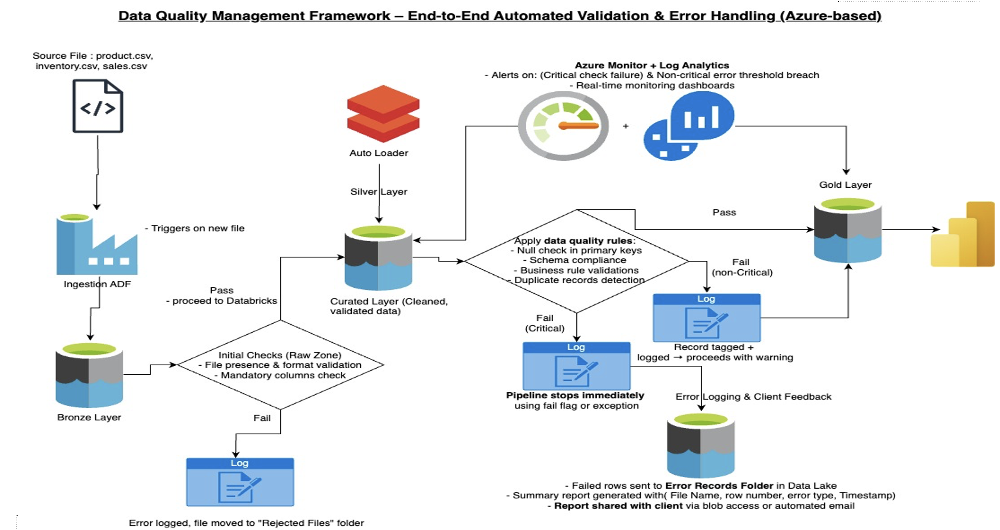

# 🏥 Pulse Corp Data Engineering Case Study

## 📌 Overview

This case study showcases a robust, scalable data architecture built for Pulse Corp, an e-commerce company dealing with consumer electronics. The objective is to ensure real-time analytics, schema flexibility, zero manual intervention, and trusted reporting through automated data pipelines built on Azure.

---

## 🚨 Problem Statement

### 🏢 Company Background

Pulse Corp is a mid-sized retail company specializing in selling consumer electronics through its online platform. With a growing customer base and a wide product range, the company aims to improve operational efficiency and customer experience through better data insights.

---

### 📈 Business Problem

- Inconsistent product, inventory, and sales data across systems.
- Lack of reliable and timely analytics for operations and business reporting.
- Need for automated pipelines to scale with data volume and evolving schemas.

---

### ⚙️ Technical Problem

- **Real-time data availability** for analytics; **1-day tolerance** for reporting.
- **Zero-click pipelines** with automated validation and error logging.
- **Schema evolution support**: Input files can change (column order or new columns) without needing pipeline modifications.

---

## ✅ My Solution Strategy

### 💡 How This Architecture Supports Pulse Corp

- **Real-Time Analytics**: Achieved using Azure Databricks streaming for dashboards and ad-hoc analysis.
- **Daily Reporting**: Curated Gold Layer supports Power BI, refreshed daily.
- **Data Quality**: Cleaned and validated in Silver Layer, with automated DQ checks.
- **Zero Manual Effort**: Triggered pipelines + monitoring via Azure Monitor ensure 0-click operations.
- **Schema Flexibility**: Auto Loader with `mergeSchema=true` supports schema changes.
- **Scalable & Modular**: Follows Medallion Architecture (Bronze → Silver → Gold) for clear separation of concerns.

---

## 🧱 Architecture Diagrams

> Add these three diagrams in the `assets/` folder:
> - `ingestion_architecture.png`
> - `data_quality_architecture.png`
> - `medallion_overview.png`

| Ingestion Architecture | Data Quality Framework | Medallion Overview |
|------------------------|------------------------|--------------------|
|  |  |  |

---

## 🏗️ Technical Stack

- **Cloud**: Azure Data Factory, Azure Data Lake Gen2, Azure Monitor
- **Processing**: Databricks, PySpark, Delta Lake
- **Data Quality**: Built-in validation rules, error zones, DQ reports
- **BI & Reporting**: Power BI
- **Dev Principles**: Schema evolution support, modular pipelines, alerting and observability

---

---

## 📊 Sample Business Questions Answered

- 🏪 What’s the current stock of Product X in Warehouse Y?
- 💰 What revenue has Category A generated YTD and LTD?
- 📈 How are sales and inventory trending across products and time?

---

## 🧠 Key Learnings & Impact

- ⚙️ End-to-end Azure pipeline development with schema-evolution tolerance
- ✅ Real-world scalable DQ automation using PySpark
- 📐 SCD2 modeling in Delta for history and accuracy
- 🔍 Transparent logs and alerting with Azure Monitor
- 🚀 BI-ready Gold Layer powering real-time dashboards and reports

---

## 👨‍💻 About Me

**Nitesh Ranjan Singh**  
Data Engineer @ IQVIA | Azure | PySpark | Delta Lake | Power BI  
📧 [niteshranjansingh85389@gmail.com](mailto:niteshranjansingh85389@gmail.com)  
🔗 [LinkedIn](https://www.linkedin.com/in/nitesh0007/)

---

## 📄 License

This project is open-source and available under the [MIT License](LICENSE).

